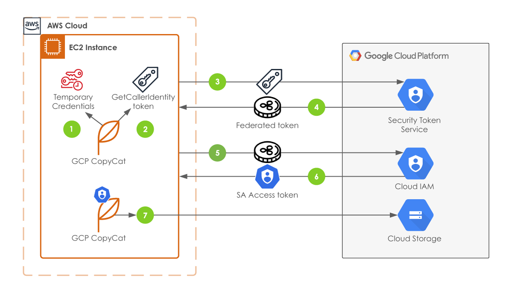

# GCP Data engineering related topics.

### Workload identity federation 
[workload identity federation with aws role to gcp](https://scalesec.com/blog/access-gcp-from-aws-using-workload-identity-federation/)
[video on WIF from aws assume role to gcp](https://www.youtube.com/watch?v=Eh0mJwFo9Ak)

**Token flow identity**

